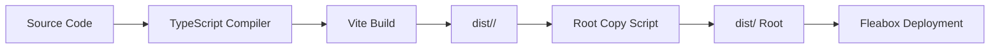

# Fleaoffice Architecture

## Overview

Fleaoffice is a modern, web-based personal productivity suite designed to run on [Fleabox](https://github.com/nicholasgasior/fleabox), a lightweight self-hosted application hub. The suite consists of four applications that share a common technical foundation while remaining independently deployable.

### Design Philosophy

- **Minimal Resource Footprint**: Requires only a few MB of RAM to run
- **Mobile-First**: Beautiful, responsive UI designed for mobile and desktop
- **Self-Hosted**: User data stays on your server, stored as simple files
- **Modern Yet Simple**: Clean architecture without feature bloat or legacy baggage

### Suite Components

| App | Status | Purpose |
|-----|--------|---------|
| **write** | ✅ Implemented | Elegant markdown document editor |
| **agenda** | 🚧 Placeholder | Meeting and task management |
| **list** | 🚧 Placeholder | Item-based list management |
| **show** | 🚧 Placeholder | Modern presentation creation |

## Technology Stack

### Core Technologies

| Technology | Version | Purpose |
|------------|---------|---------|
| **React** | 19.2.0 | UI framework - latest with concurrent features |
| **TypeScript** | 5.9.3 | Type-safe development with strict mode |
| **Vite** | 7.3.1 | Fast build tool and dev server |
| **React Router** | 7.1.3 | Client-side routing (write app) |

### Build & Development

| Tool | Purpose |
|------|---------|
| **ESLint** | Code quality and style enforcement |
| **Playwright** | End-to-end testing framework |
| **npm workspaces** | Monorepo dependency management |

### App-Specific Libraries

**Write App:**
- **Milkdown** (7.18.0) - Extensible markdown editor framework
  - `@milkdown/react` - React integration
  - `@milkdown/core` - Core editor functionality
  - `@milkdown/plugin-history` - Undo/redo support
  - `@milkdown/plugin-listener` - Event handling
  - `@milkdown/plugin-upload` - Image upload support
  - `@milkdown/preset-commonmark` - Standard markdown syntax
  - `@milkdown/theme-nord` - Nord color scheme

## Architectural Patterns

### 1. Monorepo Structure

```
fleaoffice/
├── write/           # Markdown editor (fully implemented)
├── agenda/          # Meeting & task manager (placeholder)
├── list/            # List manager (placeholder)
├── show/            # Presentation tool (placeholder)
├── docs/            # Architecture and technical documentation
├── dist/            # Build output (all apps)
└── package.json     # Root build orchestration
```

Each app is:
- **Independently buildable**: `cd write && npm run build`
- **Self-contained**: Own dependencies, config, and tests
- **Consistently configured**: Shared build patterns and tooling

### 2. Build System

The build system uses a two-phase approach:

**Phase 1: Per-App Build**
```bash
tsc -b              # TypeScript compilation
vite build          # Bundle with Vite
```

**Phase 2: Root Aggregation**
```bash
npm run build       # Builds all 4 apps sequentially
npm run copy        # Copies to root dist/ directory
```

**Output Structure:**
```
dist/
├── write/
│   ├── index.html
│   └── assets/
├── agenda/
├── list/
└── show/
```

### 3. Integration with Fleabox

Fleabox is the hosting platform that:
- Serves static files from `/srv/fleabox/<app-id>/`
- Provides a REST API for data operations
- Handles authentication via cookie-based tokens
- Stores user data in `~/.local/share/fleabox/<app-id>/data/`

**API Contract:**
- `GET /api/<app-id>/data/<path>` - Read file or list directory
- `PUT /api/<app-id>/data/<path>` - Write file (auto-creates parent dirs)
- `DELETE /api/<app-id>/data/<path>` - Delete file or directory

**Key Integration Points:**
1. **Base Path Configuration**: Each app uses `base: '/<app-name>/'` in Vite config
2. **API Proxy**: Dev server proxies `/api` to `localhost:3000` (Fleabox)
3. **Authentication**: Automatic via cookies (transparent to apps)
4. **Data Storage**: Apps use simple REST calls, Fleabox handles persistence

### 4. Component Architecture (Write App Example)

The write app demonstrates the architectural patterns used across the suite:

```
App (main.tsx)
├── MilkdownProvider        # Editor context
└── HashRouter              # Client-side routing
    ├── Route "/"
    │   └── DocumentList    # List all documents
    │       └── DocumentCard[]
    └── Route "/editor/:filename"
        └── Editor          # Edit single document
            ├── EditorToolbar
            ├── MilkdownEditor
            └── SaveStatus
```

**Key Patterns:**
- **Centralized Storage Hook**: `useStorage()` provides unified API access
- **Auto-Save Logic**: `useAutoSave()` hook with 2-second debounce
- **Optimistic UI**: Immediate updates with error rollback
- **Hash-Based Routing**: Compatible with static file serving (no server routing)

### 5. Data Flow

```
User Action → Component State → useStorage Hook → Fleabox API
                                       ↓
                                  Local Cache
                                       ↓
                              Filesystem Storage
```

**Example: Saving a Document**
1. User types in Milkdown editor
2. `onContentChange` callback updates component state
3. `useAutoSave` debounces for 2 seconds
4. `storage.saveFile()` makes PUT request to `/api/write/data/doc.md`
5. Fleabox writes to `~/.local/share/fleabox/write/data/doc.md`
6. Response confirms success, UI shows "Saved" status

## Technical Decisions & Rationale

### Why React 19?

- **Modern Concurrent Features**: Improved rendering performance
- **Server Components Ready**: Future-proof for potential SSR
- **Mature Ecosystem**: Extensive library support
- **Team Familiarity**: Well-known patterns and best practices

### Why Vite?

- **Speed**: Fast cold starts and hot module replacement
- **ESM Native**: Modern module system, no legacy bundler overhead
- **TypeScript Support**: First-class TypeScript integration
- **Dev Experience**: Excellent DX with instant updates

### Why TypeScript with Strict Mode?

- **Type Safety**: Catch errors at compile time
- **Better Refactoring**: Rename, move, and change with confidence
- **IDE Support**: Superior autocomplete and inline documentation
- **Team Collaboration**: Code is self-documenting

### Why Monorepo?

- **Shared Tooling**: Single ESLint, TypeScript, and Vite config patterns
- **Dependency Management**: Coordinated updates across apps
- **Code Sharing**: Easy to extract shared utilities
- **Atomic Changes**: Related changes across apps in single PR

### Why Hash-Based Routing (Write App)?

- **Static File Compatibility**: No server-side routing configuration needed
- **Fleabox Simplicity**: Fleabox serves static files, doesn't handle routes
- **Deployment Flexibility**: Works anywhere static files can be served

### Why Milkdown for Markdown Editing?

- **Extensible**: Plugin-based architecture for custom functionality
- **Modern**: Built with ProseMirror, modern editor framework
- **React Integration**: Official React bindings
- **Active Development**: Regular updates and community support
- **Feature Rich**: History, upload, themes out of the box

### Why Playwright for Testing?

- **Cross-Browser**: Test in Chromium, Firefox, and WebKit
- **Modern API**: Async/await based, clean and readable
- **Auto-Wait**: Handles timing issues automatically
- **Network Control**: Mock and intercept API calls
- **E2E Focus**: Tests real user scenarios, not implementation details

### Why File-Based Storage?

- **Simplicity**: No database setup or migrations
- **Transparency**: Users can inspect/backup their data easily
- **Unix Philosophy**: Text files and directories, scriptable
- **Low Overhead**: Minimal memory footprint
- **Version Control**: User data can be git-tracked if desired

## Development Workflow

### Local Development

**Option 1: All Apps Together**
```bash
npm run fleabox     # Builds all, starts Fleabox on port 3000
```

**Option 2: Single App (Hot Reload)**
```bash
cd write
npm run dev         # Vite dev server on port 5173
                    # Requires Fleabox running separately for API
```

**Option 3: Single App (Production-like)**
```bash
cd write
npm run fleabox     # Builds and runs just write app
```

### Testing Strategy

**Current State:**
- Only write app has tests (Playwright E2E)
- Other apps have Playwright configured but no test files yet

**Test Structure (Write App):**
```
write/tests/
├── documents.spec.js      # Document list page
├── editor.spec.js         # Editor functionality
├── api.spec.js            # Direct API tests
└── fleabox-api.spec.js    # Low-level CRUD operations
```

**Testing Approach:**
- End-to-end tests simulate real user workflows
- Tests use Playwright's request API to set up/teardown test data
- Fleabox dev server starts automatically via Playwright config
- Tests run sequentially (workers: 1) to avoid data conflicts

### Code Quality

**Linting:**
- ESLint with TypeScript plugin
- React Hooks rules enforced
- React Refresh plugin for HMR
- Runs independently per app: `npm run lint`

**Type Checking:**
- Strict TypeScript mode enabled
- No implicit any, unused variables, or unreachable code
- Project references for incremental builds: `tsc -b`

### Build Pipeline



## Future Considerations

### Planned Features (Agenda, List, Show Apps)

**Agenda:**
- Calendar view integration
- Task management with priorities
- Meeting notes linked to calendar events

**List:**
- Flexible list structures (not rigid tables)
- Drag-and-drop reordering
- Nested lists and categories

**Show:**
- Markdown-based slide creation
- Export to PDF/HTML
- Presenter notes and timing

### Potential Technical Improvements

1. **Shared Component Library**: Extract common UI components
2. **Centralized State Management**: If apps need to communicate
3. **Progressive Web App (PWA)**: Offline support and app installation
4. **Real-time Collaboration**: WebSocket support for multi-user editing
5. **Plugin System**: Allow third-party extensions
6. **Theme Support**: Dark/light mode and custom themes
7. **i18n**: Multi-language support

### Scalability

The current architecture is designed for single-user self-hosting. For multi-user scenarios:
- **Authentication**: Would need proper user management (currently simple token)
- **Data Isolation**: Fleabox already supports per-user data directories
- **Concurrency**: File-based storage works well for low concurrency
- **Backup**: Users should implement file-based backup strategies

## Security Considerations

### Current Security Model

- **Authentication**: Cookie-based tokens (dev mode bypasses auth)
- **File Size Limits**: 10MB per file (Fleabox enforcement)
- **File System Isolation**: User data scoped to `~/.local/share/fleabox/<app>/`
- **No SQL Injection**: No database, file-based storage
- **XSS Protection**: React escapes by default, careful with `dangerouslySetInnerHTML`

### Best Practices

1. **Input Sanitization**: Filename sanitization in write app
2. **Content Security Policy**: Should be configured in Fleabox
3. **HTTPS**: Required for production deployments
4. **Regular Updates**: Keep dependencies updated for security patches

## Deployment

### Production Setup

1. Build all apps: `npm run build`
2. Copy `dist/` contents to `/srv/fleabox/`
3. Run Fleabox in production mode: `fleabox`
4. Apps accessible at `http://localhost:3000/<app-name>/`

### System Requirements

- **RAM**: ~10MB per app
- **Storage**: ~2MB per app (built)
- **Node.js**: 20+ (for building)
- **Fleabox**: Latest version from GitHub

## Conclusion

Fleaoffice represents a modern approach to personal productivity software:
- **Lightweight** by design
- **Self-hosted** for privacy and control
- **Modern** tech stack without unnecessary complexity
- **Extensible** architecture ready for future growth

The architecture prioritizes simplicity, performance, and developer experience while delivering a delightful user experience. Each technical decision serves the core mission: providing powerful productivity tools that run efficiently on modest hardware.
